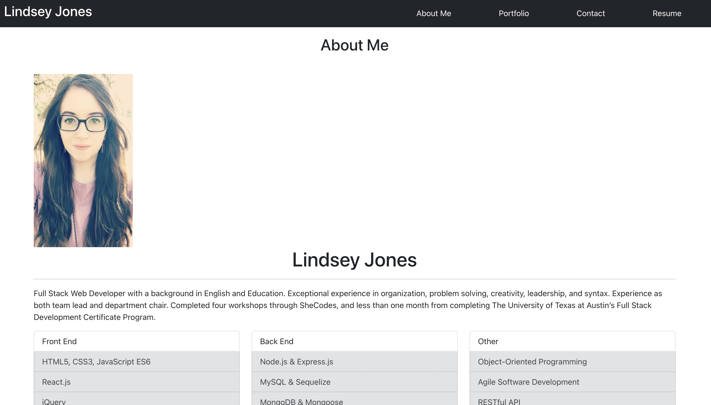
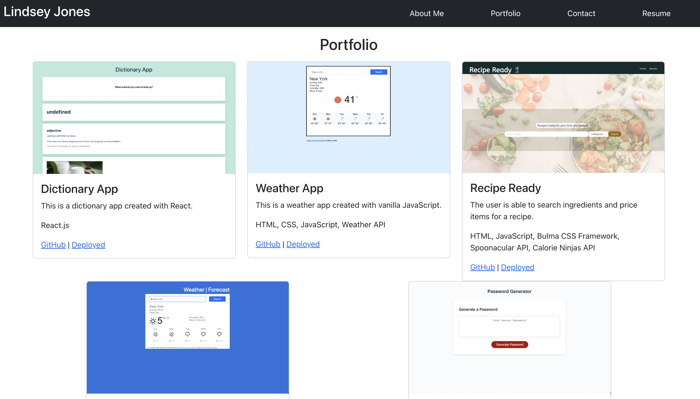
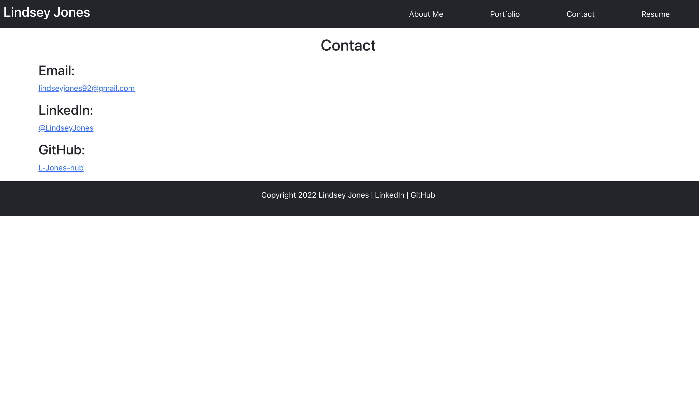
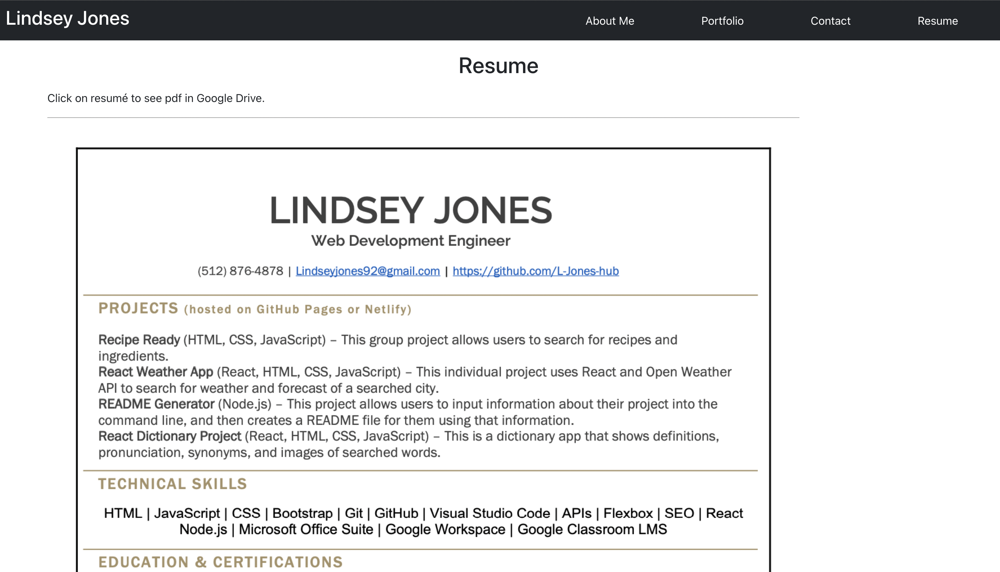

# React-Portfolio

## Description

This is a portfolio created to show my React skills.

---

| Table of Contents       |
| ----------------------- |
| [How to Use](#usage)    |
| [License](#license)     |
| [Credits](#credits)     |
| [Questions](#questions) |

---

## How to Use

The first page you will see when you open the portfolio will be the About Me page. This page gives an overview of my experience and skills.

If you click on "Portfolio" in the navigation bar, you will see this page. Each card shows a picture of the project, a description, the technologies used, a GitHub link, and a deployed link.

If you click on "Contact" in the navigation bar, you will see this page. There are links to email me, see my GitHub, and see my LinkedIn.

If you click on "Resume" in the navigation bar, you will see this page. This shows a pdf of my resume, and the pdf is also a link that will take you to my resume in Google Drive.

---

## License

    This project is under the following license: MIT.

Read about this license at [MIT license](https://choosealicense.com/licenses/).

---

## Credits

Thank you, Megan, for your help and words of encouragement!
Thank you, Ian, for helping me figure out why my navigation wasn't showing up!
Thank you, Christina, for the suggestion of how to render my projects!

---

## Questions?

| Contact Me                                   |
| -------------------------------------------- |
| [GitHub](https://www.github.com/L-Jones-hub) |
| [Email](lindseyjones92@gmail.com) |
